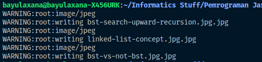
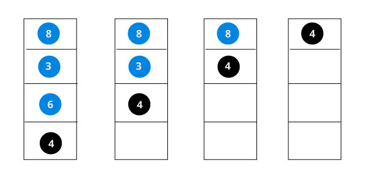
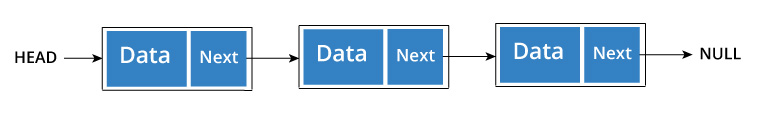

## Tugas 3 Pemrograman Jaringan

Nama  : Bayu Laksana<br>
NRP   : 05111740000020<br>
Kelas : B

Modifikasilah file program client_3.py agar dapat mengunduh lebih dari satu gambar menggunakan thread.

## Langkah-langkah

- Mempersiapkan daftar url gambar yang hendak diunduh. Dalam hal ini menggunakan `list`.

    ```py
    image_list = [
        "https://cdn.programiz.com/sites/tutorial2program/files/bst-search-upward-recursion.jpg",
        "https://cdn.programiz.com/sites/tutorial2program/files/bst-vs-not-bst.jpg",
        "https://cdn.programiz.com/sites/tutorial2program/files/linked-list-concept.jpg"
    ]
    ```

- Memasukkan ke dalam antrian thread dengan fungsi `download_gambar`.

    ```py
    thread_list = []
    for i in range(len(image_list)):
        t = threading.Thread( target=download_gambar, args=(image_list[i],) )
        thread_list.append(t)
    ```

- Menjalankan thread.

    ```py
    for each_thread in thread_list:
        each_thread.start()
    ```

## Hasil Request Menggunakan Thread

Output konsol saat program client3 dijalankan :



## Daftar Gambar yang Didownload



> Gambar 1. Sumber: https://cdn.programiz.com/sites/tutorial2program/files/bst-search-upward-recursion.jpg


> Gambar 2. Sumber: https://cdn.programiz.com/sites/tutorial2program/files/bst-vs-not-bst.jpg



> Gambar 3. Sumber: https://cdn.programiz.com/sites/tutorial2program/files/linked-list-concept.jpg