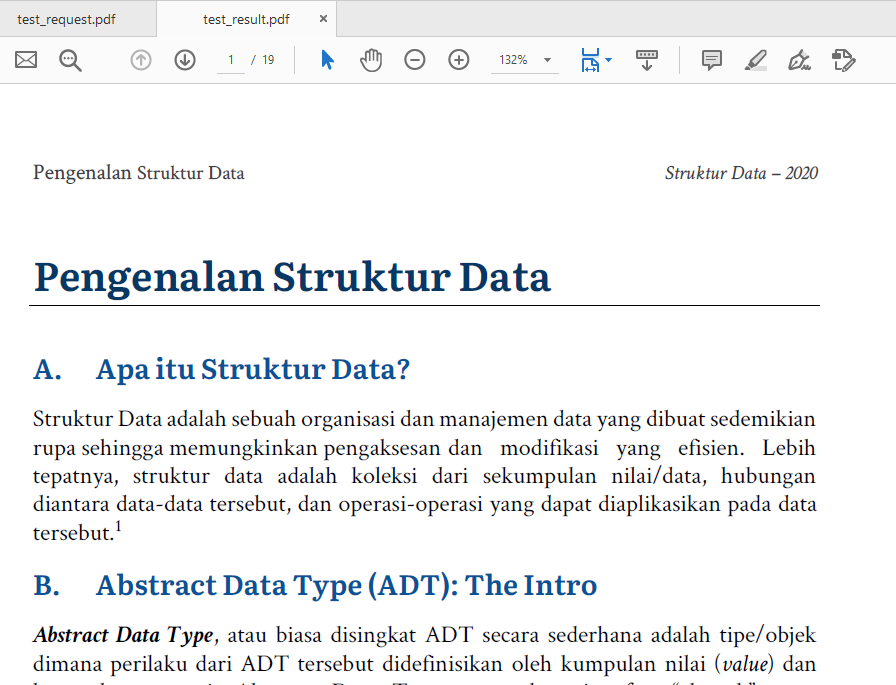

## Tugas 1 Pemrograman Jaringan

Nama  : Bayu Laksana 
NRP   : 05111740000020 
Kelas : B

### Jalankan program server.py di 3 port yang berbeda (31000, 31001, 31002).

Server berjalan pada tiga port.

- Server port 31000

    

- Server port 31001

    

- Server port 31002

    

### Jalankan program client.py untuk konek ke server yang jalan pada poin sebelumnya dan mengirimkan string “JARINGAN TEKNIK INFORPEMROGRAMAN MATIKA”.

- Client mengirim ke server port 31000

    

- Client mengirim ke server port 31001

    

- Client mengirim ke server port 31002

    

- Server merespon dari client

    

    

    

### Jalankan program server.py di 3 port yang berbeda di 2 komputer yang berbeda.

- IP komputer 1 adalah `10.151.254.205`. Server dijalankan pada 3 port yang berbeda.

    + Server port 31000

        

    + Server port 31001

        

    + Server port 31002

        

- IP komputer 2 adalah `10.151.62.227`. Server dijalankan pada 3 port yang berbeda.

    + Server port 31000

        

    + Server port 31001

        

    + Server port 31002

        

### Jalankan program client.py untuk konek ke server pada poin sebelumnya, kirimkan string yang sama.

- Hasil client mengirim dari komputer 1 menuju komputer 2 pada port 31000, 31001, dan 31002.

    

    

    

### Jalankan program server.py di 2 komputer yang berbeda, masing-masing 2 server di port yang berbeda.

Soal ini memiliki karakteristik yang sama dengan soal [ini](#jalankan-program-serverpy-di-3-port-yang-berbeda-di-2-komputer-yang-berbeda). Hanya saja dijalankan menggunakan 2 port.

----

1. ### MODIFIKASILAH program `client.py` dan `server.py` agar dapat MENTRANSFER file dari client ke server (letakkan program modifikasi di direktori tugas1a).

    [**Program `server.py` dapat dilihat disini >**](tugas1a/server.py)

    Ketika program `server.py` dijalankan, maka server akan menunggu hingga ada koneksi yang datang.

    

    [**Program `client.py` dapat dilihat disini >**](tugas1a/client.py)

    Kemudian, client mengirimkan file yang diinginkan ke server. File yang ditransfer dari client adalah file [**test_client.pdf**](tugas1a/test_client.pdf) yang kemudian server akan menyimpannya pada folder [**server**](tugas1a/server)

    

    Dan server akan merespon seperti pada gambar berikut.

    

    - File yang dikirim

        

    - File yang diterima

        

2. ### MODIFIKASILAH program server.py agar dapat mengirimkan MENTRANSFER FILE yang di request oleh client (letakkan program modifikasi di direktori tugas1b).

    [**Program `server.py` dapat dilihat disini >**](tugas1b/server.py)

    Program `server.py` dijalankan dan server akan menunggu koneksi yang datang.

    

    [**Program `client.py` dapat dilihat disini >**](tugas1b/client.py)

    Program `client.py` kemudian dijalankan untuk menerima input dan request file. File yang diminta misalkan adalah file [**test_request.pdf**](tugas1b/test_request.pdf).

    

    Kemudian, server akan merespon dan mengirimkan file yang dimaksud.

    

    Client merepson bahwa file telah diterima dan nantinya akan disimpan dengan nama "test_result.pdf" sebagai penanda bahwa file telah diterima.

    

    - File yang direquest oleh client

        

    - File yang diterima client

        