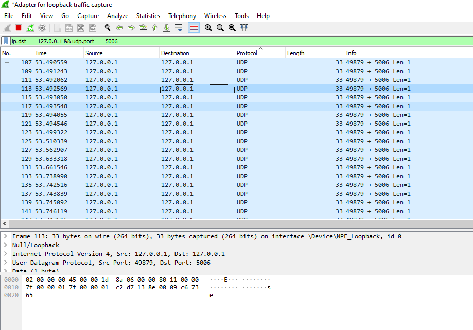
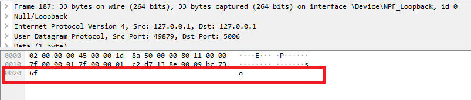
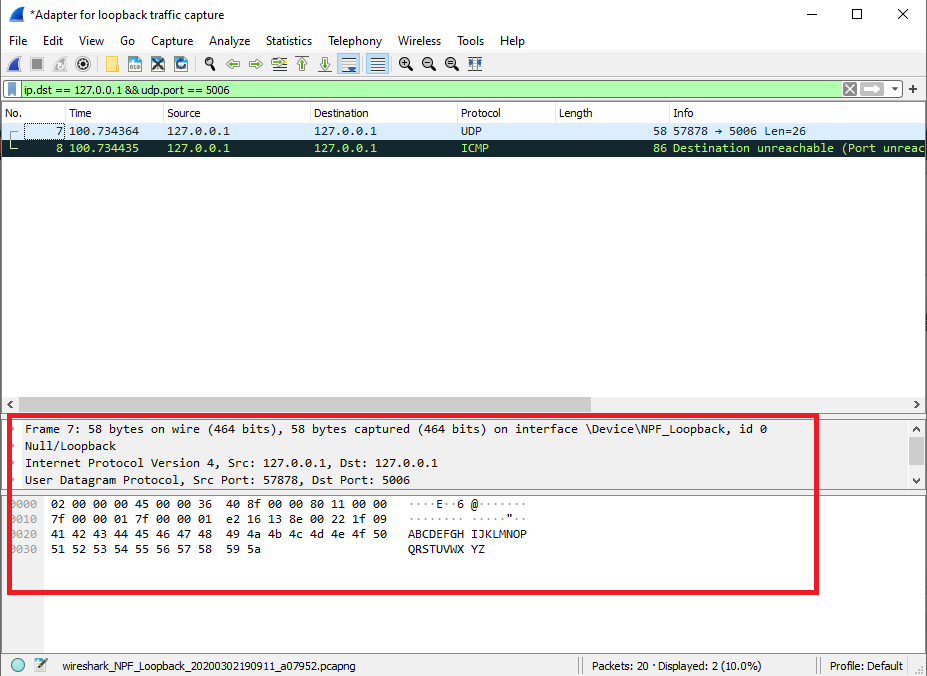

## Tugas 2 Pemrograman Jaringan

Nama  : Bayu Laksana<br>
NRP   : 05111740000020<br>
Kelas : B

### Soal 1

Menggunakan wireshark, capture hasil keluaran dari program `udpfileclient.py` ke alamat **127.0.0.1** ke port **5006**.

> Dalam hal ini, nama file yang dikirim adalah "test.txt".

Isi file `udpfileclient.py` dengan comment.

```py
import socket
import os

# IP Address target and port
TARGET_IP = "127.0.0.1"
TARGET_PORT = 5006

# Initialize for UDP socket
sock = socket.socket(socket.AF_INET, socket.SOCK_DGRAM)

# File attributes (name and size)
fileName = "test.txt"
size = os.stat(fileName).st_size

# Open and read the file
fp = open(fileName,'rb')
k = fp.read()

# Send the file to the destination
sent=0
for x in k:
   k_bytes = bytes([x])
   sock.sendto(k_bytes, (TARGET_IP, TARGET_PORT))
   sent = sent + 1
   print(k_bytes,f"terkirim {sent} of {size} ")

# Close the file and shutdown the socket
fp.close();
sock.shutdown(socket.SHUT_WR)
```

- **Command** filter pada wireshark

    ```
    ip.dst == 127.0.0.1 && udp.port == 5006
    ```

- Hasil capture setelah program dijalankan

    

    Gambar di atas merupakan paket-paket yang terkirim melalui UDP port 5006. Karena kita mempartisi file menjadi paket-paket berukuran 1 byte, maka data yang muncul juga 1 byte (1 karakter).

    

### Soal 2

Menggunakan wireshark, capture hasil keluaran dari program `udp_simple.py` ke alamat **127.0.0.1** ke port **5006**.

Isi file `udp_simple.py` dengan comment.

```py
import socket

# IP Address target and port
TARGET_IP   = "127.0.0.1"
TARGET_PORT = 5006

# Initialize for UDP socket
sock = socket.socket(socket.AF_INET, socket.SOCK_DGRAM)

# Data to send
data_to_send = "ABCDEFGHIJKLMNOPQRSTUVWXYZ"

# Send the data
sock.sendto( bytes(data_to_send.encode()), (TARGET_IP,TARGET_PORT) )
```

- **Command** filter pada wireshark

    ```
    ip.dst == 127.0.0.1 && udp.port == 5006
    ```

- Output pada console setelah program dijalankan

    ```
    b'F' terkirim 1 of 149 
    b'i' terkirim 2 of 149 
    b'l' terkirim 3 of 149 
    b'e' terkirim 4 of 149 
    b' ' terkirim 5 of 149 
    b'T' terkirim 6 of 149 
    b'e' terkirim 7 of 149 
    b's' terkirim 8 of 149 
    b't' terkirim 9 of 149 
    b'\r' terkirim 10 of 149 
    b'\n' terkirim 11 of 149 
    b'=' terkirim 12 of 149 
    b'=' terkirim 13 of 149 
    b'=' terkirim 14 of 149 
    b'=' terkirim 15 of 149 
    ...
    ...
    ...
    [Dan masih banyak lagi]
    ```

- Hasil capture setelah program dijalankan

    

    Dapat dilihat pada box warna merah, data yang terkirim sesuai ("ABCDEFGHIJKLMNOPQRSTUVWXYZ").