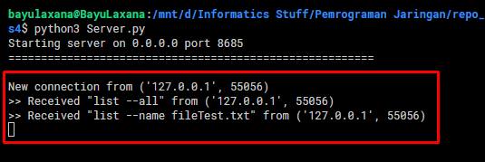

## Tugas 4 Pemrograman Jaringan

Nama  : Bayu Laksana<br>
NRP   : 05111740000020<br>
Kelas : B

----

## Deskripsi Tugas

1. Rancanglah sebuah protokol untuk:
    + Meletakkan file
    + Mengambil file
    + Melihat list file
2. Buatlah dokumentasi dari protokol tersebut berisikan:
    + Ketentuan membaca format
    + Daftar fitur
    + Cara melakukan request
    + Apa respon yang didapat
3. Gunakan format JSON untuk tugas ini.
4. Buatlah client untuk setiap operasi tersebut.

----

## Struktur Folder

Dalam Tugas 4 ini, struktur folder yang digunakan adalah sebagai berikut:
```
tugas4/
└---fileserver/
        [Berisi file-file hasil upload]
└---database/
        db.dat
|   Client.py
|   Server.py
|   FileHandler.py
|   FileDBHandler.py
```


**Keterangan:**

- File [**`Client.py`**](Client.py) digunakan untuk mengatur eksekusi dari client (request ke server).
- File [**`Server.py`**](Server.py) digunakan untuk menangani request dari client menggunakan thread dan sekaligus memproses perintah yang dikirim client.
- File [**`FileHandler.py`**](FileHandler.py) bertugas untuk menangani (backend) dari perintah-perintah.
- File [**`FileDBHandler.py`**](FileDBHandler.py) digunakan untuk menangangi operasi-operasi dalam database, dalam hal ini diletakkan dalam file **`db.dat`**.
- Folder `fileserver` digunakan untuk menyimpan file-file yang di-upload ke dalam server.

## Mekanisme Program

1. Server harus dinyalakan terlebih dahulu agar siap menerima request dari client. Tugas ini dilakukan oleh file `Server.py`.
    ```py
    # Server.py
    def run(self):
        self.sockets.bind( (self.ipAddr, self.portConn) )
        self.sockets.listen(1)

        while True:
            self.connection, self.clientAddr = self.sockets.accept()
            print(f"New connection from {self.clientAddr}")
            
            client = ClientHandler(self.connection, self.clientAddr)
            client.start()
            self.clients.append(client)
    ```

    
    > Server menunggu koneksi dari client

2. Kemudian program `Client.py` dijalankan untuk menginputkan perintah (command) yang nantinya dikirim ke server.

    - Program client menghubungkan ke server.
        
        

    - Server merespon koneksi dari client

        

----

## Ketentuan Format Protokol

Protokol yang digunakan dalam program client pada dasarnya adalah berupa string yang berisi perintah. Format stringnya adalah sebagai berikut.

```
[command] [--argumen] [value]
```

- **`[command]`** merupakan perintah.
- **`[--argumen]`** merupakan argumen dari perintah yang akan dijalankan.
- **`[value]`** berupa nama file yang hendak dikenakan perintah/operasi.

Kemudian untuk file yang di-upload akan dicatat beberapa informasi dalam bentuk **JSON** berupa:

- `id`- dari file yang di-upload.
- Nama File
- Ukuran File (dalam byte)
- Timestamp

## Daftar Fitur

**[PENTING] Mekanisme clientnya adalah :**
1. **Setiap fitur tidak dipisahkan ke client terpisah.**
2. **Semua fitur dikerjakan oleh satu client menggunakan Command-Line Interface**

Fitur-fitur yang tersedia dalam program ini adalah:

- ### Meletakkan File

    Dalam fitur ini, **client** dapat meng-upload sebuah file yang nantinya file tersebut akan disimpan di dalam folder `fileserver` dan akan dicatat oleh database.

    > File yang diupload akan mempunyai nama yang sama dengan nama asalnya.

- ### Mengambil File

    Sedangkan pada fitur mengambil file, berarti **client** dapat melakukan download sebuah file dari `fileserver` untuk disimpan dalam lokal.

    > File yang didownload akan mempunyai nama yang sama dengan nama asalnya.


- ### Melihat List File

    Client juga dapat melihat list dari file-file apa saja yang berada di folder `fileserver`. Terdapat dua cara penggunaan, yakni:

    - Melihat detail dari sebuah file, atau
    - Melihat detail dari semua file yang berada di `fileserver`

## Cara Melakukan Request

Cara/detail untuk melakukan request pada masing-masing fitur adalah sebagai berikut.

- ### Meletakkan File

    Perintah: **`upload`**<br>
    Argumen: **`--name`**<br>
    Value: nama file yang hendak diupload
    
    ```
    > upload --name [fileName]
    ```

    Contoh :

    Misalkan hendak meng-upload file `TestUpload.txt`.
    
    **Sebelum upload:**

    

    Perintah:

    ```
    > upload --name TestUpload.txt
    ```

    

    **Sesudah:**

    

    > File `TestUpload.txt` sudah ter-upload pada folder `fileserver`.

    Log pada server

    

- ### Mengambil File

    Perintah: **`download`**<br>
    Argumen: **`--name`**<br>
    Value: nama file yang hendak didownload

    ```
    > download --name [fileName]
    ```

    Contoh:

    Misalkan hendak men-download file **`fileTest.txt`** dari folder `fileserver`.

    **Sebelum:**

    

    Perintah:

    ```
    > download --name fileTest.txt
    ```

    

    **Sesudah:**

    

    Log pada server

    

- Melihat List File

    list all

    

    

    log

    
