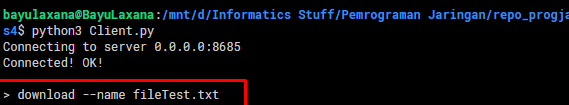
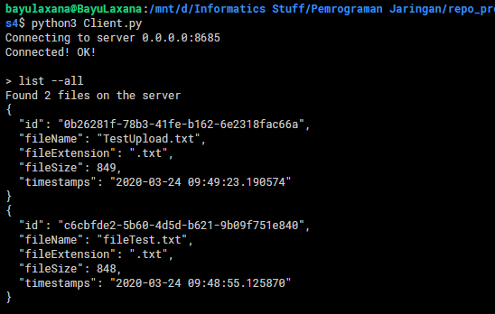
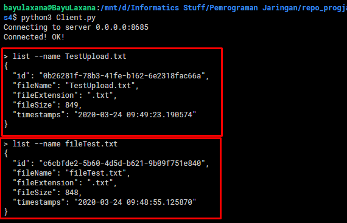

## Tugas 4 Pemrograman Jaringan

Nama  : Bayu Laksana<br>
NRP   : 05111740000020<br>
Kelas : B

----

## Deskripsi Tugas

1. Rancanglah sebuah protokol untuk:
    + Meletakkan file
    + Mengambil file
    + Melihat list file
2. Buatlah dokumentasi dari protokol tersebut berisikan:
    + Ketentuan membaca format
    + Daftar fitur
    + Cara melakukan request
    + Apa respon yang didapat
3. Gunakan format JSON untuk tugas ini.
4. Buatlah client untuk setiap operasi tersebut.

----

## Struktur Folder

Dalam Tugas 4 ini, struktur folder yang digunakan adalah sebagai berikut:
```
tugas4/
└---fileserver/
        [Berisi file-file hasil upload]
└---database/
        db.dat
|   Client.py
|   Server.py
|   FileHandler.py
|   FileDBHandler.py
```


**Keterangan:**

- File [**`Client.py`**](Client.py) digunakan untuk mengatur eksekusi dari client (request ke server).
- File [**`Server.py`**](Server.py) digunakan untuk menangani request dari client menggunakan thread dan sekaligus memproses perintah yang dikirim client.
- File [**`FileHandler.py`**](FileHandler.py) bertugas untuk menangani (backend) dari perintah-perintah.
- File [**`FileDBHandler.py`**](FileDBHandler.py) digunakan untuk menangangi operasi-operasi dalam database, dalam hal ini diletakkan dalam file **`db.dat`**.
- Folder `fileserver` digunakan untuk menyimpan file-file yang di-upload ke dalam server.

## Mekanisme Program

1. Server harus dinyalakan terlebih dahulu agar siap menerima request dari client. Tugas ini dilakukan oleh file `Server.py`.
    ```py
    # Server.py
    def run(self):
        self.sockets.bind( (self.ipAddr, self.portConn) )
        self.sockets.listen(1)

        while True:
            self.connection, self.clientAddr = self.sockets.accept()
            print(f"New connection from {self.clientAddr}")
            
            client = ClientHandler(self.connection, self.clientAddr)
            client.start()
            self.clients.append(client)
    ```

    
    > Server menunggu koneksi dari client

2. Kemudian program `Client.py` dijalankan untuk menginputkan perintah (command) yang nantinya dikirim ke server.

    - Program client menghubungkan ke server.
        
        

    - Server merespon koneksi dari client

        

----

## Ketentuan Format Protokol

Protokol yang digunakan dalam program client pada dasarnya adalah berupa string yang berisi perintah. Format stringnya adalah sebagai berikut.

```
[command] [--argumen] [value]
```

- **`[command]`** merupakan perintah.
- **`[--argumen]`** merupakan argumen dari perintah yang akan dijalankan.
- **`[value]`** berupa nama file yang hendak dikenakan perintah/operasi.

Kemudian untuk file yang di-upload akan dicatat beberapa informasi dalam bentuk **JSON** berupa:

- `id`- dari file yang di-upload.
- Nama File
- Ekstensi File
- Ukuran File (dalam byte)
- Timestamp

## Daftar Fitur

Fitur-fitur yang tersedia dalam program ini adalah:

- ### Meletakkan File

    Dalam fitur ini, **client** dapat meng-upload sebuah file yang nantinya file tersebut akan disimpan di dalam folder `fileserver` dan akan dicatat oleh database.

    > File yang diupload akan mempunyai nama yang sama dengan nama asalnya.

- ### Mengambil File

    Sedangkan pada fitur mengambil file, berarti **client** dapat melakukan download sebuah file dari `fileserver` untuk disimpan dalam lokal.

    > File yang didownload akan mempunyai nama yang sama dengan nama asalnya.


- ### Melihat List File

    Client juga dapat melihat list dari file-file apa saja yang berada di folder `fileserver`. Terdapat dua cara penggunaan, yakni:

    - Melihat detail dari sebuah file, atau
    - Melihat detail dari semua file yang berada di `fileserver`

## Cara Melakukan Request

Cara/detail untuk melakukan request pada masing-masing fitur adalah sebagai berikut.

- ### Meletakkan File

    Perintah: **`upload`**<br>
    Argumen: **`--name`**<br>
    Value: nama file yang hendak diupload
    
    ```
    > upload --name [fileName]
    ```

    Contoh :

    Misalkan hendak meng-upload file `TestUpload.txt`.
    
    **Sebelum upload:**

    

    Perintah:

    ```
    > upload --name TestUpload.txt
    ```

    

    **Sesudah:**

    

    > File `TestUpload.txt` sudah ter-upload pada folder `fileserver`.

    Log pada server

    

- ### Mengambil File

    Perintah: **`download`**<br>
    Argumen: **`--name`**<br>
    Value: nama file yang hendak didownload

    ```
    > download --name [fileName]
    ```

    Contoh:

    Misalkan hendak men-download file **`fileTest.txt`** dari folder `fileserver`.

    **Sebelum:**

    

    Perintah:

    ```
    > download --name fileTest.txt
    ```

    

    **Sesudah:**

    

    Log pada server

    

- ### Melihat List File

    Perintah: **`list`**<br>
    Argumen: **`--all`** atau **`--name`**<br>
    Value: nama file yang hendak didownload jika menggunakan argumen `--name`

    ```
    > list --all
    > list --name [fileName]
    ```

    + Contoh `list -all`

        Perintah `list --all` akan menampilkan respon dari server berupa JSON yang berisi informasi dari semua file yang berada pada `fileserver`.

        ```
        > list --all
        ```

        

    + Contoh `list --name [fileName]`

        Perintah `list --name [fileName]` akan menampilkan respon dari server berupa JSON yang berisi informasi dari nama file yang dinginkan dari folder `fileserver`.

        ```
        > list --name fileTest.txt
        ```

        

## Respon yang didapat Client

Client akan memperoleh respon dari server sesuai dengan perintah yang dikirimkan. **Semua respon diterima oleh client dalam bentuk JSON (Javascript Object Notation)**.

- ### Meletakkan File

    Respon yang didapatkan client setelah upload berupa file response text dan detail informasi file yang telah diupload **dalam bentuk JSON**.

    

- ### Mengambil File

    Respon yang didapatkan client setelah download file berupa response text dan detail informasi file yang telah didownload **dalam bentuk JSON**.

    

- ### Melihat List File

    Respon yang didapatkan client pada fitur ini, tergantung argumen yang dikirimkan ke server. Terdapat dua argumen, yakni `--all` atau `--name [fileName]`. Masing-masing respon **berupa JSON** yang berisi detail informasi file.

    + `list --all`

        

    + `list --name [fileName]`

        

## Client Untuk Melakukan Operasi

- [**Program Client.py dapat dilihat disini >**](Client.py)
- [**Program untuk menangani request client >**](Server.py)

Seluruh operasi tersebut tidak dilakukan terpisah pada client tersendiri, melainkan menggunakan metode **Command-Line Interface pada satu client**. Mekanismenya adalah:

1. Client mengirimkan string request ke server.

    ```py
    # Client.py

    while True:
        cmdInput = input("> ")
        cmdSplit = cmdInput.split(" ")
        cmd = cmdSplit[0]
        
        if cmd == "exit" or cmd == "quit":
            sock.send(cmdInput.encode())
            break
        else:
            if cmd == "download":
                print("Downloading file...")
            sock.send(cmdInput.encode())
    ```

2. Server akan menggunakan thread untuk memproses request dari client. Request akan dilimpahkan ke `ClientHandler`.

    ```py
    # Server.py

    class ClientHandler(threading.Thread):
    def __init__(self, connection, addr):
        self.connection = connection
        self.clientAddr = addr
        threading.Thread.__init__(self)

    def run(self):
        while True:
            data = self.connection.recv(1024)
            comm = data.decode("utf-8")
            if comm == "exit" or comm == "quit":
                break
            else:
                print(f">> Received \"{comm}\" from {self.clientAddr}")
                response = commExe.execute(comm)
                self.connection.send(response.encode())
        
        print(f"Connection from {self.clientAddr} closed")
        self.connection.close()
    ```

3. `ClientHandler` menggunakan `CommandExcecutor` untuk mengeksekusi request dari client.

    ```py
    # FileHandler.py

    # Class CommandExecutor:
    #
    #
    def execute(self, cmdInput: str):
        cmdSplit = cmdInput.split(" ")
        cmd = cmdSplit[0]

        if self.checkCommand(cmd) == False:
            return "Error, unrecognized command\n"

        if cmd == "upload":
            resp = self.upload(cmdSplit[1], cmdSplit[2])
            return resp
        elif cmd == "list":
            if cmdSplit[1] == "--all":
                return self.list(cmdSplit[1])
            else:
                return self.list(cmdSplit[1], cmdSplit[2])
        elif cmd == "download":
            resp = self.download(cmdSplit[1], cmdSplit[2])
            return resp
    ```

4. Sisanya akan dilakukan oleh `FileHandler.py` dan `FileDBHandler.py` untuk proses backend.

5. `ClientHandler` akan mengembalikan respon ke client setelah perintah dijalankan.
    
