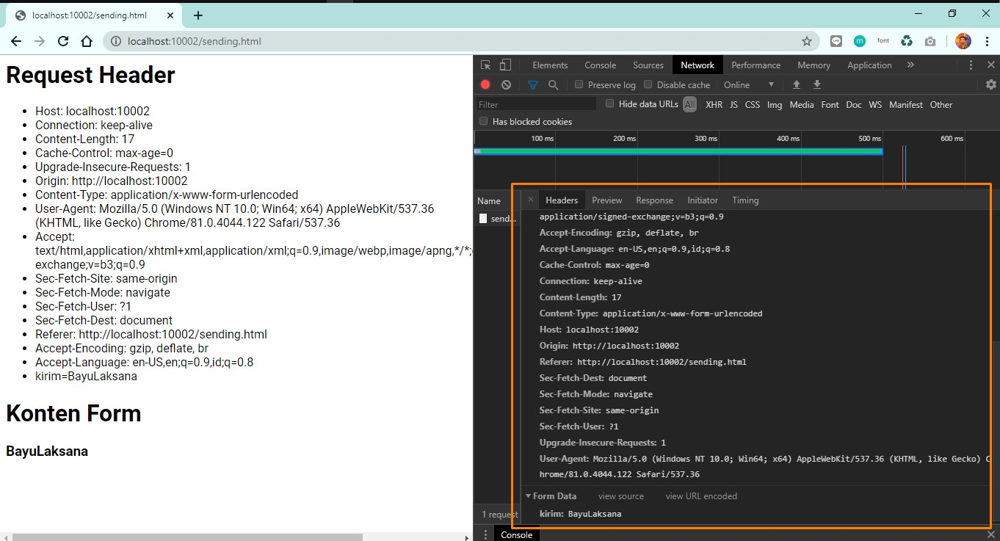

## Tugas 8 Pemrograman Jaringan

Nama  : Bayu Laksana 
NRP   : 05111740000020 
Kelas : B

----

## Menjalankan Program Sebelum Modifikasi

Bukalah browser arahkan ke http://127.0.0.1:10002/sending.html , isilah dengan sesuatu dan kirim.

- Membuka http://127.0.0.1:10002/sending.html

    

- Hasil setelah menekan 'kirim'

    

    > Akan keluar hasil berupa string `kosong`

## Modifikasi Program

### Instruksi

**Modifikasilah agar server dapat membalas dengan isi:**

- Semua header yang dikirim dari browser,
- Yang anda isikan di form pada saat mengisi pada poin nomor 5, misalkan mengisi “ISILAH” maka server akan mereply dengan “ISILAH” juga , dan bukan ‘kosong’.

### Hasil

*Program modifikasi dapat dilihat pada file [http.py](http.py) dan [server_thread_http.py](server_thread_http.py)*

- Membuka http://127.0.0.1:10002/sending.html dan mengisikan form dengan sebuah string, contohnya disini adalah **`BayuLaksana`**.

    

- Hasil setelah menekan 'kirim'

    

    > Konten kotak oranye bagian atas adalah isi **header request dari browser**. Sedangkan bagian bawah merupakan **isi dari form** yang dikirim.

    
    
